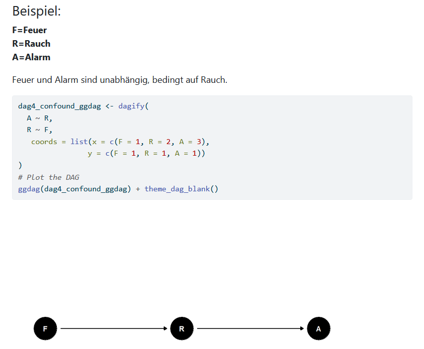

# Causal Case Study: d-separation 

### Abstract

This case study explains the concept of d-seperation. Two variables are said to be d-separated if all paths between them are blocked (otherwise they are d-connected). Two sets of variables are said to be d-separated if each variable in the first set is d-separated from every variable in the second set. 

The case study provides an overview of the rules, that determine whether a path is blocked or not including simple examples illustrating those rules. All rules and examples are visualised in DAGs (Directed acyclic graphs). Finally, a more complex DAG is discussed in order to show how all backdoor paths between two variables can be closed, so that they are d-seperated.

### Current State and Call for Extension

Currently, the DAGs and examples are generated in a quarto document. In the future, the data product could be developed further in terms of 

* An interactive version of the examples in a shiny app with R/Python
* Simulated or real data examples with empirical results that illustrate the statistical properties of d-separation
* A taxonomy of DAGs and d-separation in the sense of a glossary
